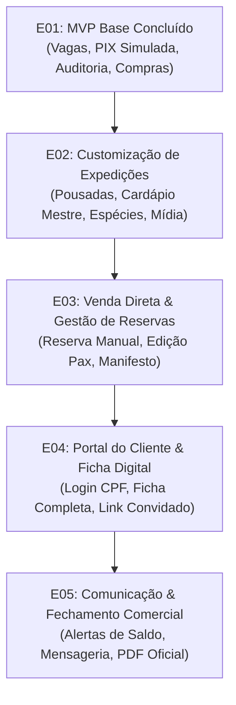

# Especificação de Requisitos, Regras de Negócio e Gaps Operacionais
> **Documento Base para Construção das Próximas Épicas (E02+)**  
> **Status:** `DRAFT / BACKLOG SPECIFICATION`  
> **Data de Criação:** 19/09/2026  
> **Autoridade e Governança:** Conforme `docs/sdd/CONSTITUTION.md` e `docs/sdd/NORMATIVE_INDEX.json`

---

## 1. Visão Geral e Propósito

Após a validação da **Épica E01 (P0)** — que estabeleceu as garantias transacionais de vagas, hold de 15 minutos, concorrência, auditoria de pagamentos e consolidação de bebidas padrão —, este documento mapeia todas as regras de domínio, lacunas funcionais e requisitos de engenharia necessários para que o stakeholder opere o negócio com total autonomia e os clientes tenham uma jornada de viagem completa.

Ele serve como **fonte da verdade e backlog normativo** para derivar as próximas épicas do projeto (`E02`, `E03`, `E04` e `E05`).

---

## 2. Domínio de Expedições Customizáveis (O que o Stakeholder precisa configurar)

Atualmente, o modelo de expedição possui campos majoritariamente textuais e o frontend depende de valores fixos no código (como fotos mapeadas por slug e benefícios comerciais estáticos). No mundo real da pesca esportiva de grandes bagres no Araguaia, as expedições variam em local, perfil, estrutura e logística.

### 2.1. Espécies-Alvo e Bioma (Invariantes da Região)
Os peixes da bacia hidrográfica do Araguaia não mudam aleatoriamente; são espécies catalogadas com comportamentos e temporadas conhecidos.
- **Catálogo Fixo de Espécies do Domínio:**
  - *Grandes Bagres (Peixes de Couro):* Piraíba (*Brachyplatystoma filamentosum*), Pirarara (*Phractocephalus hemioliopterus*), Filhote / Bargada, Barbado, Jaú, Cachara / Pintado.
  - *Peixes de Escama / Isca Artificial:* Tucunaré Azul, Tucunaré Amarelo, Bicuda, Apapá Amarelo / Dourado, Aruanã, Cachorra Larga.
- **Regra de Negócio:**
  - O stakeholder não cadastra peixes do zero a cada expedição.
  - A expedição deve permitir associar quais são as **espécies-alvo em destaque** daquela viagem (ex.: *Expedição Piraíba Bruta* foca 90% em Piraíba e Pirarara; *Pescaria de Casais* inclui pescaria de escamas na galhada e praias).

### 2.2. Locais, Pousadas Parceiras e Logística
O stakeholder opera em diferentes bases e trechos de rio. Cada base tem logística e instalações distintas.
- **Entidade `Destination / Lodge` (Pousada ou Base de Apoio):**
  - Nome da Pousada (ex.: Pousada Solar das Águas, Pousada Canaã, Barco-Hotel Araguaia).
  - Cidade e Estado (ex.: São Félix do Araguaia — MT, Bandeirantes — GO, Luiz Alves — GO).
  - Trecho do Rio (ex.: Rio Araguaia principal, Rio das Mortes, Rio Cristalino).
  - Infraestrutura do local (Wi-Fi, piscina, ar-condicionado, quartos duplos/triplos, alimentação completa, fábrica de gelo).
  - Coordenadas geográficas e orientações de trajeto terrestre (asfalto, trecho de terra, balsa).
  - Ponto de Encontro Oficial e horários de transfer (ex.: "Aeroporto de Goiânia às 06h", "Aeroporto de São Félix do Araguaia", "Direto na Pousada").

### 2.3. Cardápio Mestre de Bebidas (Cervejas e Refrigerantes Pré-dispostos)
O conceito adotado é o de **Cardápio Mestre de Bebidas**. Em vez de cadastros abertos e dispersos, o sistema conta com um catálogo enxuto e padronizado restrito exclusivamente às marcas e produtos já acordados na operação All Inclusive:
- **Cervejas Oficiais:** Heineken, Original, Amstel e Cerveja sem álcool (Heineken 0.0).
- **Refrigerantes & Hidratação:** Coca-Cola (normal e zero), Guaraná (normal e zero), Água sem gás e Água com gás.
- *(Demais categorias como destilados, energéticos, vinhos ou insumos extras foram descartados e removidos do escopo).*
- **Regra de Negócio:**
  - O stakeholder define, a partir do cardápio mestre, quais dessas bebidas estarão ativas na expedição selecionada.
  - Para cada bebida ativada, define a alocação padrão prevista por pessoa (`standard_quantity_per_participant`) para cálculo automático da lista de compras.
  - O viajante escolhe preferências booleanas ("desejo / não desejo"), sem necessidade de digitar quantidades.

### 2.4. Tralhas e Equipamentos de Pesca (POSTERGADO / FORA DE ESCOPO NO MOMENTO)
- **Decisão do Stakeholder:** Como o stakeholder ainda **não informou os tipos e modelos específicos de tralhas/produtos a serem comercializados ou locados**, esta frente fica temporariamente postergada e fora de escopo para as próximas épicas imediatas.
- **Comportamento Mantido:**
  - O checklist individual da viagem continuará focado exclusivamente nos itens essenciais de preparação pessoal e regulamentação:
    - Documento de identidade oficial (RG/CNH);
    - Licença de Pesca Amadora Embarcada válida (Federal MPA / Estadual);
    - Medicamentos de uso pessoal;
    - Vestuário com proteção UV e capa de chuva leve;
    - Protetor solar e repelente;
    - Óculos de sol com lente polarizada.
  - Qualquer módulo de venda, locação ou catálogo detalhado de varas/carretilhas só será desenhado quando o stakeholder definir formalmente seu portfólio de produtos.

### 2.5. Pacote Comercial, Inclusões e Tipos de Tarifa
- **Estrutura de Tarifação:**
  - *Por Pessoa (Single / Pescador Avulso em Dupla):* Ex.: R$ 5.600 por pescador em barco duplo.
  - *Por Casal / Dupla Fechada:* Ex.: R$ 8.400 por casal (barco exclusivo, quarto privativo).
  - *Barco Inteiro / Exclusivo (Single Fisherman):* Taxa extra para pescar sozinho com o piloteiro.
- **Inclusões Estruturadas (Flags Comerciais):**
  - Combustível incluso (ilimitado ou cota em litros por dia).
  - Iscas vivas inclusas (quantidade de tuviras e minhocuçus por barco/dia).
  - Piloteiro profissional nativo da região.
  - Gastronomia All Inclusive (café, almoço na pousada ou barranco, petiscaria de praia, kit sashimi/ceviche, jantar).
  - Open bar no barco e na pousada.
  - Torneio esportivo com troféus e premiação simbólica.
- **Não Inclusos Claramente Sinalizados:**
  - Transporte aéreo/terrestre até a base de encontro.
  - Licença de pesca pessoal obrigatória.
  - Gorjetas para guias e camareiras.
  - Tralhas pessoais de pesca (com opção de locação prévia).

---

## 3. Gestão e Operações do Stakeholder (Painel Administrativo)

### 3.1. Criação Manual de Reservas (Venda Direta / Balcão / WhatsApp)
- **Problema Atual:** O sistema só cria reservas pelo fluxo público de checkout com PIX simulado. O organizador frequentemente fecha negócios no WhatsApp ou por telefone e precisa registrar a reserva no sistema.
- **Requisitos de Engenharia:**
  - Endpoint `POST /api/operations/reservations/` para o admin criar reserva diretamente.
  - Informar dados do comprador (Nome, CPF, WhatsApp, E-mail).
  - Selecionar expedição e quantidade de vagas (1 a 12).
  - Selecionar status inicial:
    - `HELD`: Vaga travada por X dias com link de pagamento enviado para o cliente.
    - `CONFIRMED`: Reserva já negociada e confirmada (com registro opcional de pagamento direto).
  - Inserir nomes preliminares dos participantes.
  - Registrar justificativa/motivo para a trilha auditada de auditoria (`ReservationEvent`).

### 3.2. Edição de Participantes e Transferência de Titularidade
- Permitir ao administrador:
  - Alterar nomes e telefones de participantes após a compra.
  - Substituir participante (caso de desistência de um amigo e entrada de outro pescador).
  - Resetar ou reaplicar status de onboarding quando os dados de um novo participante precisarem ser coletados.

### 3.3. Manifesto de Embarque e Exportação de Passageiros
- **Problema Atual:** Existe apenas exportação da lista de compras (bebidas).
- **Requisitos de Engenharia:**
  - Tela e exportação (PDF e CSV limpo) do **Manifesto Oficial de Embarque**:
    - Nome completo de cada participante.
    - CPF e RG / Órgão emissor.
    - Data de nascimento e idade.
    - Cidade e UF de residência.
    - Telefone e contato de emergência (Nome + Telefone com parentesco).
    - Restrições alimentares e alergias medicamentosas/alimentares.
    - Número da licença de pesca (se preenchido).
  - Este documento é exigido pelas capitanias, órgãos ambientais (ICMBio/SEMA) e pela administração da pousada.

### 3.4. Compartilhamento Direto de Links (Magic Links)
- No drawer da reserva no painel:
  - Botão de um clique: *"Copiar Link do Cliente (Minha Expedição)"*.
  - Botão de *"Enviar Cobrança de Saldo por WhatsApp"* com texto pronto contendo link seguro.

### 3.5. Mídia e Assets da Expedição
- Cadastro de URLs ou upload de fotos de capa, fotos da pousada, barcos e peixes capturados naquela data para enriquecer o card e a página pública da expedição.

---

## 4. Jornada e Operação do Cliente (Pescador / Viajante)

### 4.1. Portal do Cliente e Reacesso ("Minha Reserva")
- **Problema Atual:** A sessão fica em `sessionStorage`. Se o cliente fechar o navegador, ele perde o acesso e não há botão de login no site.
- **Requisitos de Engenharia:**
  - Botão **"Minha Reserva"** no cabeçalho do site (`SiteHeader`).
  - Modal / Página de acesso simplificado:
    1. O cliente digita seu CPF e Telefone celular.
    2. O sistema valida e autentica.
    3. Retorna lista de viagens associadas ao cliente (`GET /api/me/reservations/`).
    4. O cliente clica e abre diretamente a página `Minha Expedição`.
  - Persistência adequada de sessão (Token seguro renovável).

### 4.2. Formulário de Ficha de Embarque do Participante
- **Problema Atual:** O backend já possui suporte a `cpf`, `phone`, `birth_date`, `emergency_contact_name`, `emergency_contact_phone` em `CustomerParticipantSerializer`, mas a tela `CustomerJourney` nunca implementou o formulário visual. O status de cadastro fica permanentemente "PENDING".
- **Requisitos de Engenharia:**
  - Componente de formulário individual na tela `Minha Expedição`:
    - Nome completo (editável se permitido ou fixo).
    - CPF e Data de Nascimento (para seguro-viagem e capitania).
    - WhatsApp próprio do participante.
    - Contato de emergência (Nome, Telefone e Relação/Parentesco).
    - Cidade/UF de origem.
    - Tamanho de camiseta / colete (P, M, G, GG, XG).
    - Campo de observações de saúde (alergias a medicamentos, condições cardíacas, diabetes, etc.).
  - Ao salvar, marca o participante como `onboarding_status = COMPLETED` e remove o alerta no painel administrativo.

### 4.3. Link de Convidado para a Dupla / Parceiro de Barco
- Em pescarias, geralmente um pescador (titular) paga a reserva da dupla ou do quarteto.
- O titular não quer passar seu acesso financeiro para o parceiro, mas precisa que o parceiro preencha seus próprios dados, bebidas, restrições e checklist.
- **Requisito:** Link com token assinado de participante (`/expedicoes/[slug]/ficha/[participant_token]`) que abre exclusivamente a ficha de cadastro, bebidas e checklist daquele participante específico, sem exibir saldo a pagar ou dados financeiros da reserva.

---

## 5. Matriz de Épicas Propostas para o Roadmap

Com base nos gaps mapeados, o trabalho futuro deve ser dividido em quatro épicas incrementais com escopo bem delimitado:

### Épica E02 — Customização de Expedições & Cardápio Mestre
- **Escopo:**
  1. Cadastro e modelagem de Pousadas / Destinos com infraestrutura e ponto de encontro.
  2. Cardápio Mestre de Bebidas (Cervejas Heineken, Original, Amstel e Refrigerantes) com seleção por expedição e quantidade padrão por pessoa.
  3. Associação de espécies-alvo em destaque por expedição.
  4. Inclusões / exclusões comerciais estruturadas.
  5. Cadastro de imagens/mídia por expedição (capa e fotos).
  *(Tralhas e equipamentos permanecem postergados para definição futura do stakeholder).*

### Épica E03 — Vendas Diretas, Gestão de Reservas e Manifesto de Embarque
- **Escopo:**
  1. Criação manual de reservas pelo stakeholder no painel `/admin` (venda balcão/WhatsApp).
  2. Edição de nomes, telefones e substituição de participantes pelo admin.
  3. Geração e exportação do **Manifesto de Embarque** (PDF e CSV) para pousada e autoridades.
  4. Ações rápidas de cópia de link de reserva no painel.

### Épica E04 — Portal do Cliente, Reacesso e Ficha de Embarque Digital
- **Escopo:**
  1. Fluxo de login/reacesso do cliente pelo CPF no cabeçalho do site ("Minha Reserva").
  2. Listagem de expedições ativas do cliente autenticado.
  3. Formulário visual completo de Ficha de Embarque no `CustomerJourney` (dados pessoais, emergência, camiseta).
  4. Link compartilhável de participante para a dupla preencher sua própria ficha sem acesso financeiro.

### Épica E05 — Automação de Saldos e Comunicação Operacional
- **Escopo:**
  1. Rotina automática para notificação e marcação de saldos vencidos.
  2. Exportação em PDF com identidade visual para o checklist e manifesto de viagem.
  3. Alertas de preparação e contagem regressiva personalizada para o viajante.

---

## 6. Critérios de Aceite e Próximos Passos

1. **Aprovação Humana:** Este documento deve ser revisado pelo stakeholder/desenvolvedor para confirmar as prioridades das regras de negócio levantadas.
2. **Transformação em Épica Ativa:** Uma vez selecionada a próxima frente (por exemplo, `E02` ou `E03/E04`), cria-se o diretório correspondente em `specs/active/` com `spec.md`, `grill.md` e os gates normativos da Constituição §5.
